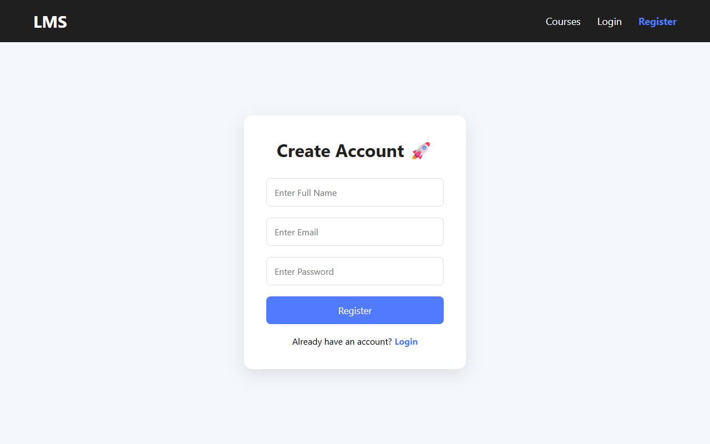
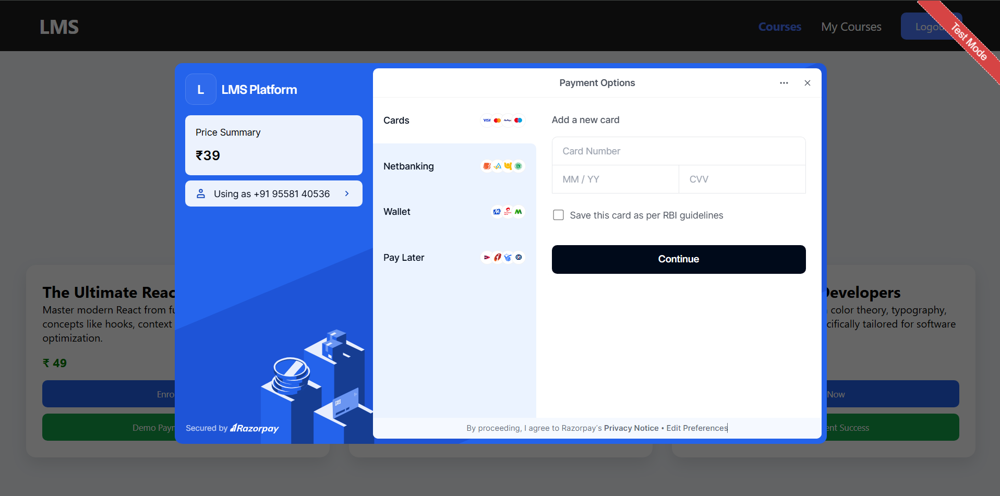
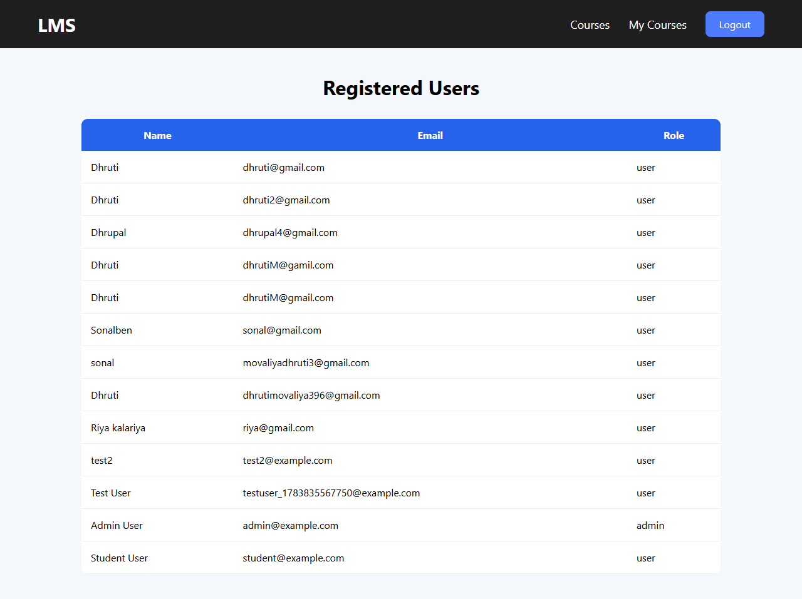
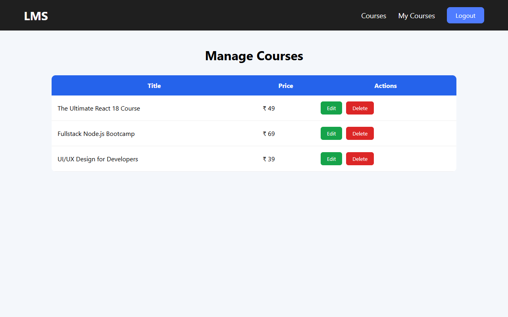
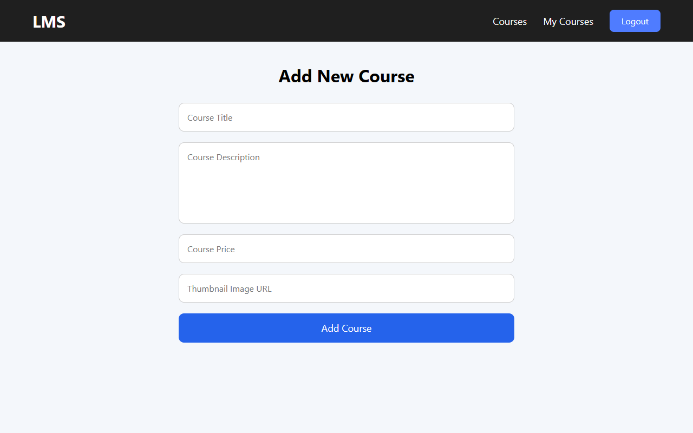
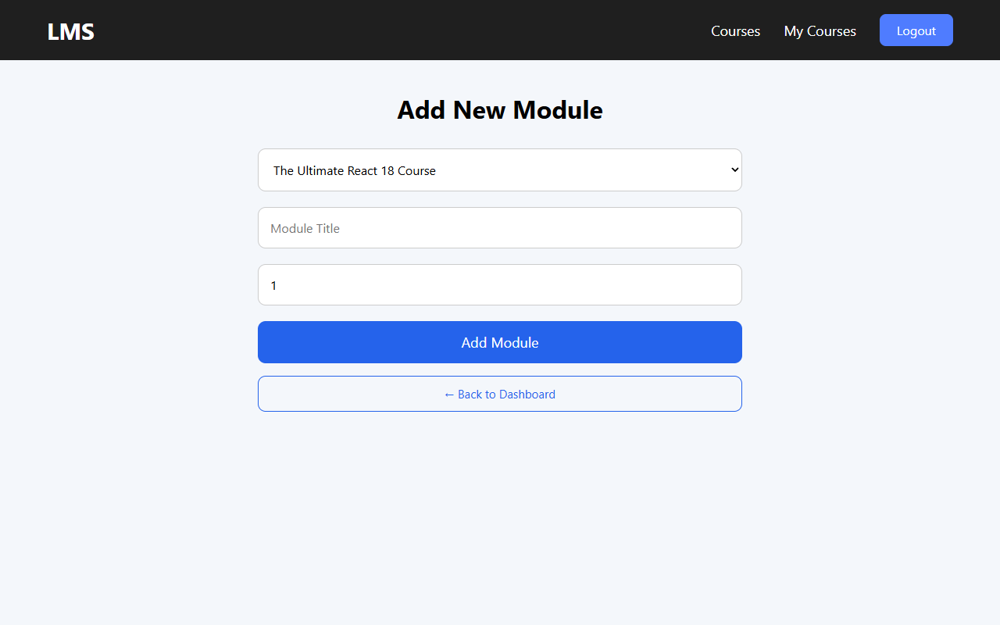
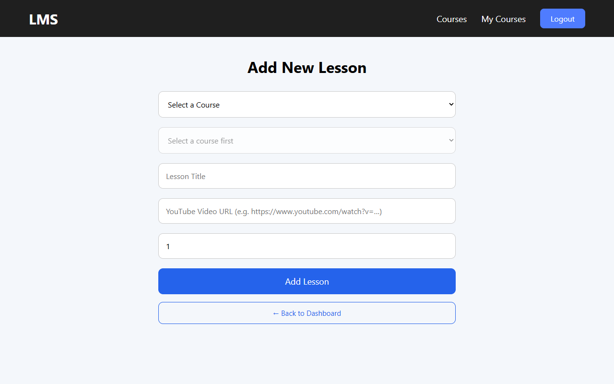

# 📚 Online Course Platform

A full-stack MERN Learning Management System (LMS) where users can register, verify their emails, browse courses, purchase enrollments via Razorpay, and track their learning progress. It includes a comprehensive Admin panel for managing courses, modules, lessons, and users.

---

## 🌟 Task 8 Requirements - 10/10 Implementation

This project was built to fulfill the **Task 8: Online Course Platform** rubric. Every requirement has been met:

### 1. 🔐 Authentication
- **User Registration & Login** with secure password hashing (`bcrypt.js`).
- **JWT-based authentication** (tokens stored locally, verified via middleware).
- **Email Verification** (users must click an emailed link to log in).
- **Forgot Password** (secure reset token sent via email).

### 2. 🏠 User Dashboard
- **View all available courses** (Publicly visible without logging in).
- **Search and filter** courses by text, min price, and max price.
- **View course details** (Title, description, price, and a public preview of the module/lesson titles).

### 3. 💳 Enrollment Flow
- Select a course and click **"Enroll Now"**.
- Complete payment via **Razorpay Test Mode**.
- On successful cryptographic webhook verification, the course is added to the user's dashboard.

### 4. 🎓 Learning System
- **Access enrolled courses** through the `/my-courses` portal.
- **Modules → Lessons structure** properly mapped in the database.
- **Video playback** via embedded YouTube URLs.
- **Mark lessons completed** with a persistent UI toggle.
- **Track progress (%)** via dynamic progress bars reading from the `completedLessons` array.

### 5. 🛡️ Admin Panel
Protected by a strict `<AdminRoute />` guard to prevent unauthorized access.
- **Add/Edit/Delete courses**.
- **Add modules and lessons** (featuring cascading course → module dropdowns).
- **View users and enrollments** in a tabular layout.

### 6. 📊 Data & Notifications
- Store enrollment and payment data correctly mapped to Mongoose models.
- **Email notifications** sent via Nodemailer for: Registration Verification, Forgot Password, and Successful Enrollment.

---

## 🛠️ Tech Stack

**Frontend:** React, Vite, React Router, Axios, CSS Modules  
**Backend:** Node.js, Express.js  
**Database:** MongoDB (Mongoose)  
**Authentication:** JWT, bcrypt.js  
**Payments:** Razorpay API  
**Emails:** Nodemailer  

---

## ⚙️ Installation & Setup

### 1. Clone the repository
```bash
git clone https://github.com/DhrutiM39/synent-task3--Online-Course-Platform--Dhruti.git
cd "synent-task3--Online-Course-Platform--Dhruti"
```

### 2. Backend Setup
```bash
cd server
npm install
```

Create a `.env` file inside the `server` folder:
```env
PORT=5000
MONGO_URI=your_mongodb_connection_string
JWT_SECRET=your_jwt_secret_key
EMAIL_USER=your_gmail@gmail.com
EMAIL_PASS=your_gmail_app_password
CLIENT_URL=http://localhost:5173
RAZORPAY_KEY_ID=your_razorpay_test_key
RAZORPAY_KEY_SECRET=your_razorpay_secret
ALLOW_DEMO_PAYMENTS=false
```

Run the backend server:
```bash
npm run dev
```

*(Optional)* Run the seed script to populate the database with courses and videos:
```bash
node seed.js
```

### 3. Frontend Setup
```bash
cd client
npm install
```

Create a `.env` file inside the `client` folder:
```env
VITE_ALLOW_DEMO=false
```

Run the frontend:
```bash
npm run dev
```

---

## 📸 Screenshots

Here is the visual journey of the full-stack Online Course Platform:

### 🔐 User Registration & Authentication
| Register Page |
| --- |
|  |

### 🏠 Student Portal
| Course Catalog (Public) | Course Page Details | My Courses (Enrolled) |
| --- | --- | --- |
|  |  |  |

### 💳 Payments Integration
| Razorpay Checkout Overlay |
| --- |
|  |

### 🛡️ Admin Dashboard (Protected Management)
| Dashboard Overview | Users & Enrollments | Courses Management |
| --- | --- | --- |
|  |  |  |

### ➕ Course Content Creation
| Add Course Form | Add Module Form | Add Lesson Form |
| --- | --- | --- |
|  |  |  |

---

## 👩‍💻 Author

**Dhruti**  
Built as part of a full-stack development internship project.
